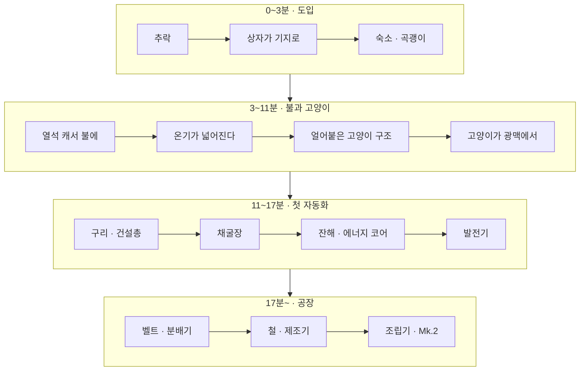
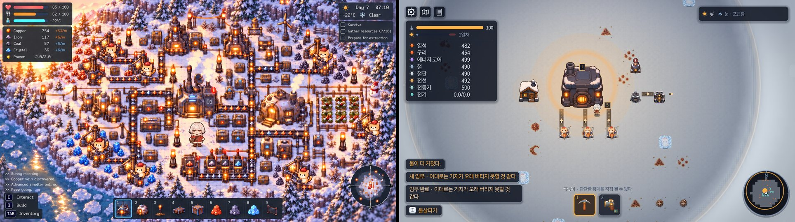
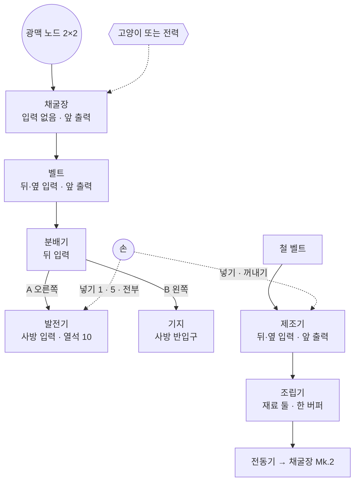
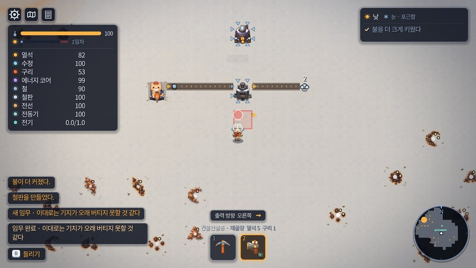
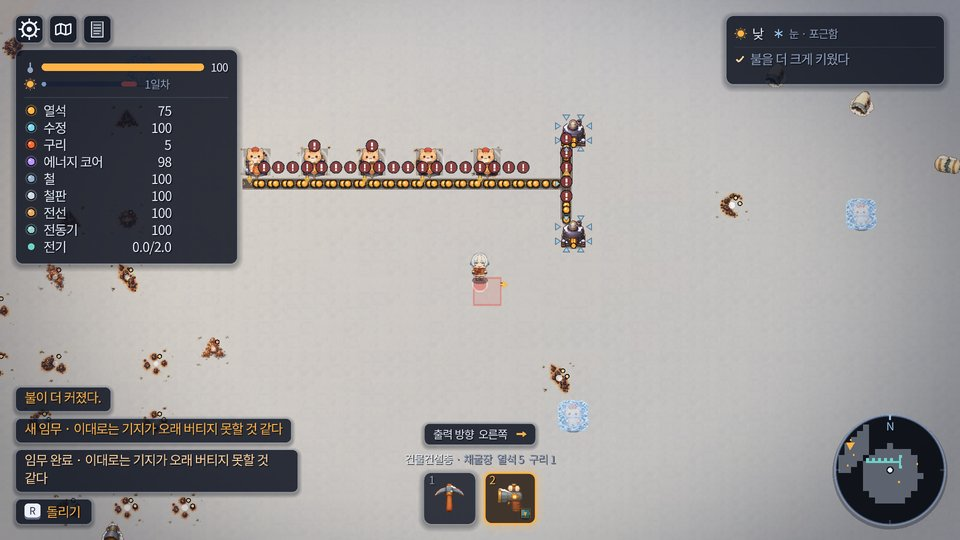
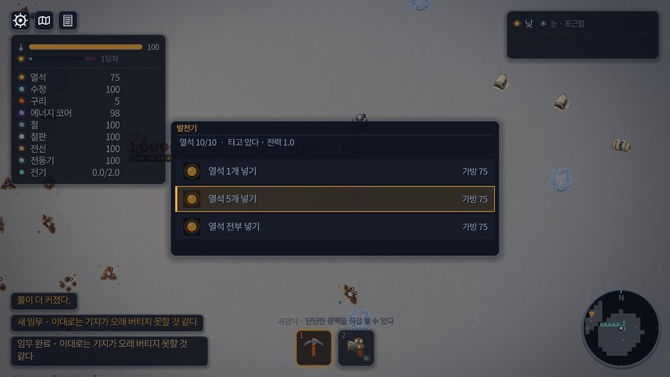
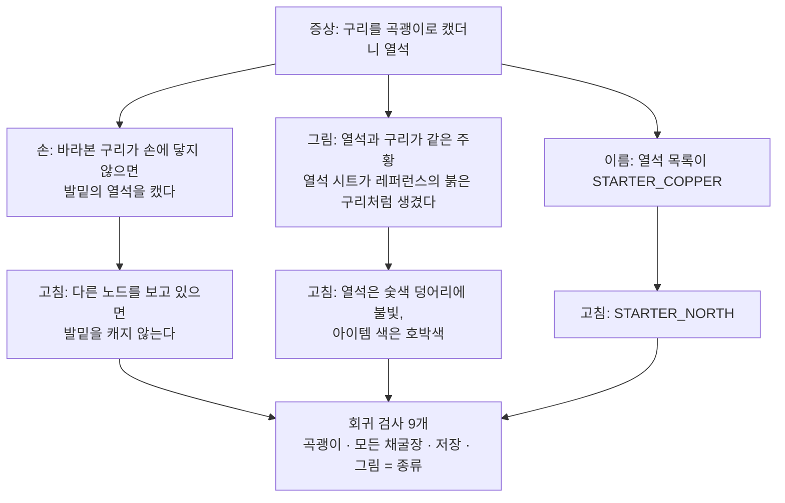
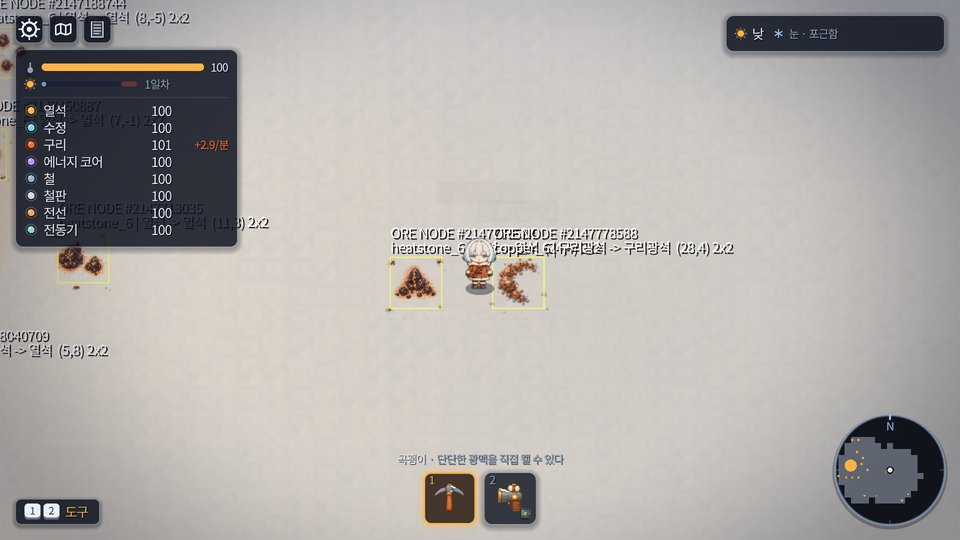
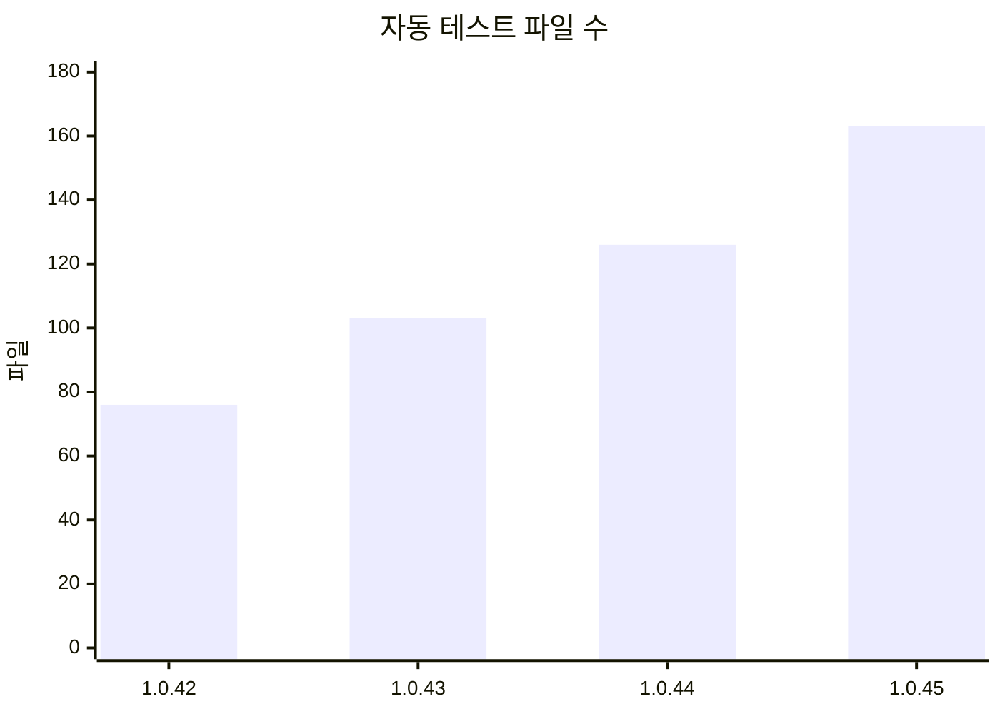

# 진행 상황 — 지금까지의 Motorio

2026-09-29 · **1.0.45** 기준. 이 문서는 "지금 어디까지 왔나"를 한 장에 모은 것이고, 자세한 것은 각 보고서·
Releases·Decisions에 있다. 무엇을 만들려는지는 **Vision**, 무엇이 남았는지는 **Todo**, 무엇을 정했는지는
**Decisions**를 본다.

---

## 한 줄로

눈 덮인 행성에 불시착한 Grim이 **불(기지)을 키워 온기를 넓히고**, 얼어붙은 고양이를 구해 함께 **광맥을
캐고 공장을 짓는** 게임이다. 첫 23분의 길(추락 → 기지 → 고양이 → 채굴장 → 발전기 → 벨트 → 철 → 제조기)이
처음부터 끝까지 이어지고, 그 위에 **포트로 이어지는 공장**(1.0.45)까지 왔다.

## 지금 게임에서 하는 일 — 첫 23분

`GOLDEN_PATH_0_23.md`의 사다리를 그림으로 줄였다. 시간은 목표치이고, 각 단계는 테스트가 지킨다.

## 걸어온 길

140번의 릴리스를 시기별로 묶었다. 한 줄 한 줄은 **Releases**에 있다.

| 시기 | 무엇이 들어왔나 | 버전 |
|---|---|---|
| 7월 28일~8월 3일 | 첫 빌드, 누적되는 하루, 모바일 조작, 고양이 노동, 분배기·전력·벨트 등급, 로딩 28MB → 12MB | 0.1 ~ 0.15 |
| 8월 8일~13일 | 주인공 Grim과 스프라이트 파이프라인, 고양이가 걷고 먹고 일한다, 가챠(뒤에 끔), 벨트 오토타일링, 지도 | 0.20.2 ~ 0.20.59 |
| 8월 14일~17일 | 이름이 Motorio로, 첫 자원 열석, 고양이는 사는 것이 아니라 구하는 것, 오프닝 7장, 불은 손으로 먹인다, **1.0.0**(폰에서 전부 확인) | 0.20.60 ~ 1.0.0 |
| 8월 18일~23일 | 온기 밖은 땅에 얼어붙어 있다, 횃불, 숙소가 월드 위의 방, 냥마을, 휠 확대 | 1.0.1 ~ 1.0.26 |
| 8월 31일~9월 2일 | 수정이 사라지고 발전기가 열석을 먹는다, 철·제조기·조립기, 첫 23분을 설계한 대로, 하루 36분, 상자가 기지로 | 1.0.27 ~ 1.0.40 |
| 9월 24일~29일 | 한 벌의 HUD, Grid v2, 소리와 연출, 광맥 2×2·건물 그림, 포트·손·회전 | 1.0.41 ~ 1.0.45 |

## 최근 네 번의 작업

| 작업 | 날짜 · 버전 | 무엇 | 보고서 |
|---|---|---|---|
| Grid v2 | 09-26 · 1.0.43 | 칸을 32px에서 16px로. 건물은 여러 칸, 세계의 거리는 그대로 | `GRID_V2.md` |
| Quality Pass 01 | 09-27 · 1.0.43 | 소리 체계와 연출 언어. 바람 루프 버그, 깨어나는 장면, 펼쳐지는 기지 | `QUALITY_PASS_01_REPORT.md` |
| World Visual Pass 01 | 09-28 · 1.0.44 | 광맥 2×2 노드, 채굴기가 노드 하나를 덮는다, 고양이는 채굴기 위, 눈과 건물 그림 | `WORLD_VISUAL_PASS_01_REPORT.md` |
| Factory Interaction Pass 01 | 09-29 · 1.0.45 | 광석 정체 버그, 포트, 손으로 넣기·꺼내기, 설치 후 회전, 분배기 4방향, 줌 | `FACTORY_INTERACTION_PASS_01.md` |

## 공장은 이렇게 이어진다 (1.0.45)

설비는 **포트**로만 받고 낸다. 앞면은 출력, 뒤와 양옆은 입력이고, R로 돌리면 포트도 함께 돈다. 벨트가 없어도
발전기·제조기·조립기에 **손으로** 넣고, 만든 것을 꺼낼 수 있다.

## 이번에 고친 가장 큰 버그 — "구리를 캤는데 열석이 나온다"

생성이 광석을 덮어쓴 것이 아니었다(200시드에서 0회). 세 가지가 같은 얼굴로 왔다.

## 테스트가 지키는 것

자동 테스트 파일 수. 새 기능마다 그것이 무엇을 막는지 `TESTS.md`에 한 줄씩 있다.

## 열려 있는 결정

Decisions에서 사람의 결정을 기다리는 것들.

| # | 질문 | 상태 |
|---|---|---|
| 18 | 하루 길이 — 180초로 시작한 질문. 지금 코드는 낮 30분 + 해질녘 2분 + 밤 4분 = 36분 | 열림 |
| 23 | 자원 투석기 — 벨트가 못 하는 것은 뛰어넘는 것 | 열림 |
| 24 | 자원 상자와 땅 밑 파이프 | 열림 |
| 25 | 자원 열차 | 열림 |
| 32 | 옆·앞으로 먹이던 옛 세이브의 분배기와 제조기 — 불러올 때 고쳐 줄 것인가 | 열림 |

## 알려진 것과 다음

- 사람이 공장을 한 바퀴 직접 해 보지 않았다. 포트 표시만으로 "앞면으로는 안 들어간다"가 읽히는지는 사람만 답한다.
- 벨트를 한 칸씩 깐다 — 드래그 설치가 다음으로 가치 있는 일이다.
- 공급이 소비보다 빠르면 줄 전체의 벨트가 막힘 표시로 덮인다 — 병목 한 곳만 말하게 한다.
- 나머지는 **Todo**에.

## 문서 지도

- **Vision** — 무엇을 만들려는가: `VISION` · `CORE_LOOP` · `PROGRESSION` · `WORLD_AND_STORY` · `VERTICAL_SLICE` · `CURRENT_STATE`, 그리고 규칙 문서(`GRID_V2` · `AUDIO_DIRECTION` · `PRESENTATION_RULES` · `GOLDEN_PATH_0_23` …)
- **Progress** — 이 문서, 작업 보고서, Todo, Releases, Decisions
- 원본은 전부 저장소의 `motorio/design/`이다. 사이트는 그 파일을 읽어서 그린다.
