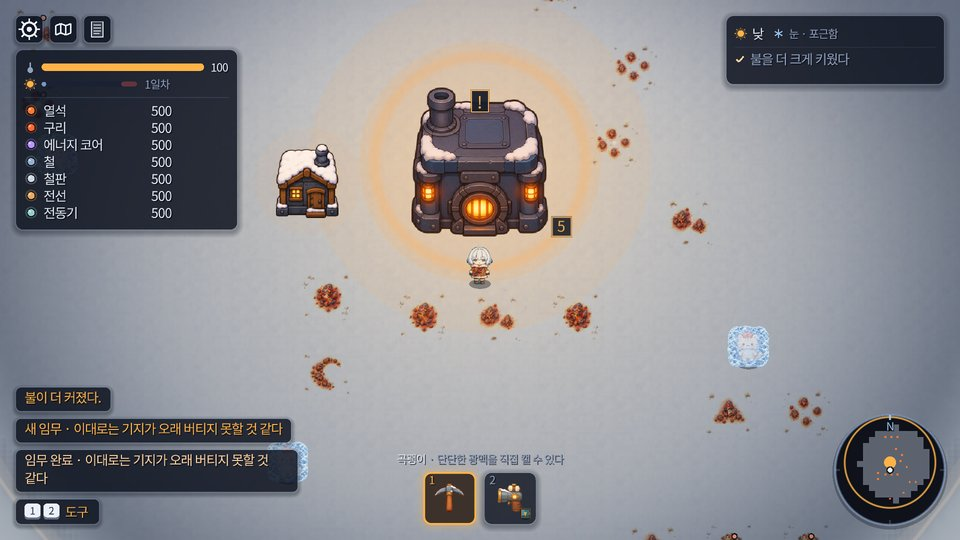
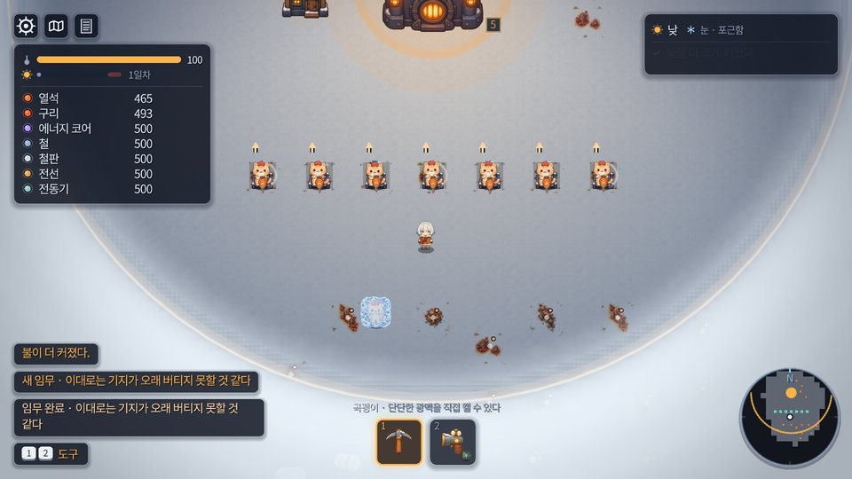

# WORLD VISUAL PASS 01 — 보고서

상태: `[확정]` · 2026-09-28 · motorio 1.0.43 → 1.0.44

광맥·채굴 거점·숙소·추위 소리·눈 바닥·건물 그림을 Visual North Star
(`design/reference/motorio-visual-north-star.png`)에 가깝게 옮긴 작업의 결과. 설계 규칙은
`GRID_V2.md` §4(광맥과 거점), `AUDIO_DIRECTION.md` §3(추위), 검사 목록은 `TESTS.md`.

---

## SUMMARY

- **광맥은 2×2 노드**가 됐고(정체는 원점 하나, 광맥을 묻는 API 한 벌, 옛 칸 사전 삭제), **채굴기는 그 노드
  하나를 정확히 덮는 2×2**다. 목표 노드를 명시적으로 들고 저장한다.
- **"구리 채굴기가 열석을 낸다"의 원인**은 채굴기가 아니라 건설총이었다: 4×4 거점이 그녀 몸에 걸리면
  마주 본 광맥을 건너뛰고 그 뒤의 광맥(대개 열석)에 지었다. 총은 이제 마주 본 노드에만 붙는다. 없는
  광맥에서 수정조각을 지어내던 틱의 대체값도 지웠다.
- **고양이는 채굴기 위에서** 일한다(작업 자리는 표의 데이터, 길찾기는 그 칸만 연다, 층·출력 분리).
- **숙소는 4×4 오두막**(앵커 같음, 옛 발자국 안). 광맥이 비켜 가는 땅은 숙소 벽이 아니라 따로 정한 공터다.
- **추위 소리가 반복된다**: 불 밖에서 체온이 떨어지는 동안 몇 초마다, 따뜻해지거나 숙소·잠·일시정지·
  게임오버에서 멈춘다.
- **눈 바닥**: 격자선과 얼룩이 없는 네 변형의 한 장. 광맥 타일의 제 눈도 걷어냈다.
- **건물 그림 여덟**: 차가운 금속 + 따뜻한 등, 모두 제 칸 안.
- **세이브**: 스키마 13. v12 세이브의 채굴기는 모두 제 노드 위로 돌아온다(생성이 같은 난수 경로를 밟게
  했다). 진행·밸런스·아이템 ID·격자 크기는 바뀌지 않았다(`balance.json`은 버전 문자열만 바뀜).
- 테스트 **103 → 126**, 전부 통과. 1.0.44로 배포.

## BASELINE TESTS

작업 시작 시점(커밋 `2d91aec4`, 1.0.43) 전체 스위트를 먼저 돌렸다: **103/103 PASS, SCRIPT ERROR 0**.
(이전 숫자를 가정하지 않고 새로 셌다. 러너는 파일마다 로그를 따로 받아 PASS·FAIL·SCRIPT ERROR를
센다.)

## FINAL TESTS

**126/126 PASS, SCRIPT ERROR 0** (시작 103 → 126, 신규 23개 · 이름을 바꿔 다시 쓴 것 5개 · 새 기하에 맞춘
것 약 30개). 단계마다 전체 스위트를 돌려 통과한 뒤 로컬 커밋했다:

| 단계 | 커밋 | 전체 스위트 |
|---|---|---|
| 1–3 광맥 2×2 · 채굴기 2×2 · 구리 버그 · 세이브 13 | `8a76cf4e` | 통과 |
| 4 고양이는 채굴기 위에서 | `628886ff` | 통과 |
| 5 숙소 4×4 | `24a77e74` | 통과 |
| 6 추위 소리 반복 | `091205ed` | 통과 |
| 7 눈 바닥 · 광맥 타일 | `624d694f` | 통과 |
| 8 건물 그림 | `0e3f8088` | 통과 (126/126) |

- 200시드 계약: `test_ore_nodes_do_not_overlap`(노드 200회차), `test_old_world_distance_preserved`(첫 구리·철
  띠, 시작 고양이, 첫 잔해), `test_village`, `test_crowd`, 골든 패스 다섯 — 모두 통과.
- 음성 대조: 옛 `_post_target`을 되돌려도 새 출력 검사는 통과한다(2×2 기하에서는 다음 노드가 탐색선에
  들어오지 않는다 — COPPER BUG 참조). 옛 기하에서의 재현은 1,584번 중 16번이었다.
- `python3 tools/audio_audit.py` 결함 0. `test_audio`는 디스크의 모든 소리가 어딘가에서 재생되는지 본다.
- 스위트는 사용자 설정 파일을 백업·복원하며 돈다(`test_settings`가 실제 파일을 쓴다).

## ORE 2X2

- 광맥은 **2×2 노드**(`Defs.ORE_NODE_SIZE`)이고 정체는 **원점(왼쪽 위 칸)** 하나다. 네 칸은
  정체·종류·순도·산출·채굴 속도·거점을 같이 답한다.
- 저장소가 칸마다 광맥을 들던 `Sim.ore` 사전은 **이름째 지웠다**. 노드에 대고 `ore.has(cell)`을
  물으면 네 칸 중 한 칸에만 맞는 답이 나오고 나머지 셋은 조용히 틀린다 — 그래서 되살릴 수 없게
  이름을 없애고 모든 사용처(스크립트 58곳, 테스트·도구 211곳)를 하나씩 API로 옮겼다
  (`Defs.TILE`을 지운 것과 같은 방법). API: `has_ore`, `ore_origin_at`, `ore_type_at`, `ore_item`,
  `ore_cells`, `ore_rect`, `ore_centre`, `put_ore`, `erase_ore_at`, `clear_ore`, `ore_errors`.
- 무엇이 나오는지는 `Defs.ore_output(type)` 한 곳: 아이템 표에서 광맥 그림(`atlas`)이 있는 재료가
  광맥 재료이고 자기 자신을 낸다. 등록되지 않은 종류는 아무것도 내지 않는다.
- **생성**은 노드 단위다. 원점끼리 체비셰프 `ORE_PITCH`(4) 이상 → 노드 사이에 항상 두 칸 통로.
  원점에서 거리·예약 구역을 재고(한 칸짜리 시절과 **같은 난수 경로**), 나머지 세 칸이 예약 구역에
  닿는 노드는 **모든 난수가 끝난 뒤** 지운다 — 같은 시드가 같은 노드를 만들어야 저장이 이어진다.
- 그림은 노드 하나에 한 장(32px)으로 그린다. 네 칸에 작은 그림 네 장이면 광맥 넷으로 보인다.
- 200시드 계약: 노드끼리 겹침 0, 간격 위반 0, 건물 밑 노드 0, 약속한 시작 노드 누락 0
  (`test_ore_nodes_do_not_overlap`). 기존 200시드 계약(첫 구리·철 띠, 시작 고양이, 첫 잔해)도 그대로.

## MINING POST 2X2

- 채굴기(Mk.1·Mk.2)는 **노드와 정확히 같은 2×2**다. 크기는 표의 데이터(`"size": ORE_NODE_SIZE`),
  앵커는 기본 규칙(왼쪽 위) = 노드 원점. 네 방향 모두 같은 칸을 덮는다.
- 배치 규칙(`footprint_problems`): 앵커가 노드 원점이 아니거나 발자국이 노드를 다 덮지 않으면
  "광맥 위에만 설치할 수 있습니다", 다른 노드의 칸이 걸리면 "다른 광맥이 겹칩니다", 다른 설비는
  노드의 어느 칸에도 못 선다. 짓는다고 노드 자료가 지워지지 않는다.
- 고스트는 마주 본 노드의 원점에 **붙는다**(노드의 어느 칸을 겨눠도).
- 채굴기는 목표 노드를 **`Machine.ore_node`로 명시적으로** 들고, 저장 파일에 `ore_x/ore_y`로 쓴다.
  산출·설계 수치·채굴 속도는 모두 이것에 묻는다.
- 출력은 앞 가장자리 칸(`output_anchor`)에서 그 바로 앞 칸(`output_cell`)으로 나간다.

## COPPER BUG

**보고**: "구리 채굴기가 열석을 출력한다."

**재현**(수정 전 1.0.43 코드, 시드 10개, 구리·철 광맥마다 사방·1~2칸에서 겨누기): 1,584번 중
**16번**, 구리(또는 철)를 마주 보고 지은 채굴기가 **다른 광맥(열석)** 위에 섰다. 같은 코드에서
채굴기의 틱은 1,756개 광맥 전부 제 광맥의 광석을 냈다 — **틱은 옳았다.**

**근본 원인**: `Main._post_target`. 4×4 거점은 광맥(앵커 (1,1)) 주위로 한 칸·두 칸씩 퍼지므로,
광맥 바로 앞에 선 그녀의 몸을 덮는 경우가 많았다. 그러면 총은 그 광맥을 건너뛰고 탐색선을 따라
**다음 광맥**으로 넘어갔다 — 광맥이 거점 하나 간격으로 놓인 밭에서 그것은 마주 본 광맥 **뒤의**
광맥이고, 첫 몇 링에서는 대개 열석이다. 그녀는 구리를 마주 보고 열석 위에 지었고, 채굴기는 서 있는
광맥을 정직하게 캤다. 고스트는 그 자리를 보여 줬지만 4×4 그림이 광맥을 덮어 무엇 위인지 보이지
않았다.

같은 계열의 두 가지도 함께 고쳤다:
- `_tick_miner`는 앵커에 광맥이 없으면 **수정조각(은퇴한 아이템)을 지어냈다**
  (`ore.get(cell, ITEM_CRYSTAL)`). 이제 노드가 없으면 아무것도 내지 않고 멈춤을 알린다.
  이 대체값에 기대어 통과하던 테스트가 실제로 있었다(`test_save`: 손으로 놓은 광맥은 불러오기에서
  사라지는데, 사라진 광맥 위 채굴기가 수정을 만들어 "공장이 계속 돈다"를 통과시켰다).
- v11 이주(`SaveMigration._seam_in`)는 종류를 모른 채 가장 가까운 광맥에 붙인다 — v11 파일에
  광맥 종류가 없으니 고칠 수 없는 한계이고, 노드 기준으로만 바꿨다(KNOWN ISSUES).

**수정**: 총은 탐색선이 처음 만나는 **노드** 하나를 겨누고 절대 다음으로 넘어가지 않는다(노드는
두 칸 떨어져 있어 탐색선이 두 노드를 만날 수 없다). 그 자리가 그녀 몸에 걸리면 빨간 고스트로
그 노드 위에 보이고 그녀가 물러선다. 산출은 `ore_item(machine.ore_node)` → `Defs.ore_output`.

**회귀 검사**: `test_heatstone_post_outputs_heatstone`·`test_copper_post_outputs_copper`·
`test_iron_post_outputs_iron`은 노드 사방에 다른 광석 노드를 한 피치 거리로 두고(버그가 나던 배치),
사방·노드 위·1~3칸에서 총이 고르는 앵커가 늘 그 노드인지, 그렇게 지은 Mk.1·Mk.2에 고양이를 두고
실제 게임을 돌려 출구에 떨어진 것이 **그 광석뿐**인지 본다. 음성 대조: 옛 넘어가기 코드를 2×2
배치에 되돌려 넣어도 이 검사는 통과한다 — 2×2 거점과 3칸 탐색선에서는 다음 노드가 탐색선에 들어올
수 없기 때문이다. 즉 이 버그는 **기하와 코드 두 곳에서** 막혀 있다. 코드 쪽은 넘어가는 논리 자체를
지워서 막았다.

## CAT WORK

- 고양이는 **채굴기 위에서** 일한다. 채굴기 행마다 `work_anchor`(발자국 왼쪽 위에서 칸 단위,
  `Defs.WORK_ANCHOR` = (1.0, 1.75): 가로 가운데, 아래쪽 3/4)가 **표의 데이터**로 있고,
  `Sim.work_point`(발)·`post_stand`(몸통, 발에서 `CAT_FOOT_DROP` 위)가 그것을 읽는다. 맨 노드에서는
  노드 한가운데에 서서 판다.
- 길찾기: 채굴기는 그녀에게도, 다른 모든 고양이에게도 막혀 있다. 배정된 고양이만 자기 자리에
  닿는데, `_route`가 **가려는 칸 하나만** 열기 때문이다(순간이동 없음, 한 틱 이동량 ≤ 속도×Δt).
  테스트는 "제 채굴기에서 몸이 들어서는 칸은 일하는 자리의 칸 하나뿐"을 네 방향 × 네 쪽에서 본다.
- 층: 고양이 층(z 2) > 설비 층(z 0), 고양이 그림자도 설비 위. 드릴을 든다(`cat_has_tool`).
- 출력은 `output_anchor`(앞 가장자리 칸)에서 `output_cell`로 나가고, 고양이의 발·몸통은 어느 방향에서도
  그 두 칸에 없다. 고양이가 일하는 동안 출력이 계속 나온다.
- 작업음·동시 재생 규칙(`cat_tap`, 상한 3·간격 0.28)은 그대로다.
- 발견한 문제: 불러오기·기지 전개 뒤 "건물 안에 선 고양이를 밖으로 밀어내는" 정리가 **제 채굴기 위에서
  일하는 고양이까지** 밀어냈다. 이제 자기 채굴기 위의 고양이는 그대로 둔다(`Main._clear_cats`).
- 그림으로 본 것: 고양이(키 약 31px)가 32px 채굴기의 대부분을 덮는다. 받침·드릴 날·출력 화살표는
  보이지만 뒤쪽 탑은 고양이 뒤로 들어간다(KNOWN ISSUES).

## SHELTER 4X4

- `SHELTER_SIZE` 6×8 → **4×4**. **앵커는 그대로**라 새 오두막은 옛 발자국 안에 가운데 맞춰 선다 —
  저장된 숙소는 제자리에서 줄어들고, 옛 발자국이 덮던 칸 어디에도 새것이 없다.
- 사료통은 한 칸 동쪽(`FOOD_CELL` (-4,0) → (-3,0))으로 옮겨 서쪽 벽에 붙는다(저장된 사료통 위치는
  그대로 불러온다).
- **광맥이 비켜 가는 땅은 숙소 벽이 아니라 `Defs.HUT_CLEARING`·`BIN_CLEARING`**(옛 6×8+1칸, 옛
  사료통 자리)이다. 숙소를 줄여도 문간 쪽으로 광맥이 다가오지 않고, **어느 시드의 노드도 움직이지
  않는다**(저장된 채굴기가 제 노드로 돌아오는 조건).
- 문·문간·방·밤·잠·일어나기·고양이 귀가를 새 크기에서 다시 검사했다: `test_shelter_is_4x4`,
  `test_shelter_entry_after_resize`(불 곁에서 문간까지 몸으로 걸어가 들어갔다 나오기),
  `test_cat_returns_to_shelter`, `test_sleep_wake_after_shelter_resize`.
- 그림: 차가운 금속판과 따뜻한 목재, 눈 쌓인 지붕, 노란 창 하나, 난로 연통, 닫힌 문과 계단
  (`tools/art/gen_buildings.py` → `key_buildings.gd`). 16칸을 정확히 덮는다(몸체 96%×81%). 옛 그림
  밑에 발자국을 설명하려고 칠하던 사각형은 지웠다.

## COLD AUDIO

- 보고: "추위/얼어붙는 효과음이 처음 한 번만 재생된다." 맞았다 — `frost`는 단계가 **나빠지는 순간**
  한 번만 울리고, 그 뒤로는 숨소리뿐이었다.
- 이제 **추위가 그녀를 계속 가져가는 동안** 부드러운 한기(`chill`)가 몇 초마다 난다. 조건은 `Main`이
  한 곳에서 정한다(`cooling`): 놀이 중이고, 자지 않고, 눈밭(`Zone.freezes`)이고, 불의 땅 밖이고,
  **체온이 한 프레임 전보다 낮다.**
- 추위 단계: 6~8초, -31dB(숨소리보다 작게). 위험 단계: 4~5.5초, -27dB·피치 1.06. 간격은 매번 무작위,
  녹음 세 가지를 번갈아(같은 것 연달아 없음). 규칙상 상한 1, 간격 4.0/3.5초.
- 온기·숙소·잠·일시정지·게임오버에서 없고, **울리던 것도 멎는다**(`_quiet_chill`).
- 소리: `tools/build_sfx.py`의 `made_chill` — 500~1300Hz의 낮은 공기와 작은 얼음 부스러기 넷.
  이 저장소가 한 번 버린 "고음 치찰음"(ZCR 5,200/s였던 첫 시도)을 피해 ZCR 약 2,500/s.
  `audio_audit.py` 결함 0.
- 검사 다섯: `test_cold_sound_repeats_while_temperature_falls`, `_respects_cooldown`,
  `_stops_in_heat`, `_stops_in_shelter`, `_does_not_spam`.

## SNOW

- 옛 바닥(`ground_16.png`, 열여섯 장)은 타일마다 **어두운 테두리**가 있어 눈 위에 격자를 그렸고,
  발자국·나뭇가지·얼룩이 들판에 반복됐다. 새 바닥은 `assets/tiles/snow_4.png`, **네 변형**
  (snow_01~04, 2×2 아틀라스)이고 `tools/art/build_snow.gd`가 결정적으로 만든다.
- 곱하기로 그려지므로(색은 불의 웅덩이와 추위의 바닥이 정한다) 흰색 바로 아래의 밝고 약간 푸른 색에
  몇 퍼센트의 부드러운 결만 준다. 밝기 폭 0.040, 가장 어두운 곳 0.958 — 돌·발자국·큰 얼룩 없음.
- 네 변형은 **같은 주기적 가장자리**를 공유하고 안쪽만 다르다: 어느 순서로 붙여도 이음매 차이
  0.9/255. 게임의 선택으로 깐 8×8·16×16 바닥에서 타일 경계의 변화(0.0001)가 타일 안(0.0008)보다 작다.
  줄무늬 결은 매 칸 반복되므로 넣지 않았다(첫 시도에서 보였다).
- 모든 변형은 지면 종류 `GROUND_SNOW` 하나다. 걷기·짓기·광맥·캐기가 변형과 상관없다.
- 격자는 바닥에 그리지 않는다 — 지을 때 고스트가 보여 준다.
- 광맥 타일도 같은 문제였다: 제 눈 위에 그려진 한 장의 타일이라 새 바닥 위에서 **옅은 사각형**으로
  보였다. `tools/art/build_ore_tiles.gd`가 타일마다 자기 눈(테두리 중앙값)을 나눠 없애고 옛 테두리를
  지워서, 곱하기에서 광석과 그 그림자만 남는다. 광맥 밑에도 눈을 깔고, 광석 그림은 노드보다 한쪽
  8px 크게 그린다(주변이 중립이라 광석만 퍼진다).

## BUILDING VISUALS

방향: **차가운 금속 몸체 + 따뜻한 주황·노랑 기능광**, 아늑하게. 사이버펑크·SF·실사 아님. 캐릭터
스타일 판(`tools/sprite/refs/style_plate.png`)과 Visual North Star를 참조로 넘겨 생성하고
(`tools/art/gen_buildings.py`, 프롬프트가 곧 자산이다 — 사이드카 JSON에 그대로), Godot `Image`로
키잉·잔티 제거·발자국 맞춤을 한다(`tools/art/key_buildings.gd`; 이 머신에 Pillow가 없어 설치하지 않고
저장소 안에서 해결했다). 저장 크기는 그리는 크기의 두 배(하우스 규칙).

| 우선 | 건물 | 발자국 | 무엇이 바뀌었나 | 몸체(긴 쪽×짧은 쪽) |
|---|---|---|---|---|
| P0 | 기지 | 8×8 | 둥근 화구가 타는 금속 난로집, 연통, 양옆 등. 밑에 칠하던 사각형 제거 | 97%×89% |
| P0 | 숙소 | 4×4 | 새 오두막(위 참조) | 96%×81% |
| P0 | 채굴기 Mk.1 | 2×2 | 뒤쪽 드릴 탑·등 하나, 앞쪽은 고양이가 설 판 | 95%×77% |
| P0 | 발전기 | 2×2 | 둥근 보일러, 주황 화구, 위에 구리 코일(전력 불빛을 코일 위로 옮김) | 94%×86% |
| P1 | 제조기 | 2×2 | 프레스 머리, 입구·출구 쟁반, 앞 등(작업 불빛을 등으로 옮김) | 94%×89% |
| P1 | 조립기 | 2×2 | **제 그림이 생겼다**(전에는 제조기 그림): 두 팔, 두 투입구 | 94%×92% |
| P1 | 채굴기 Mk.2 | 2×2 | **제 그림이 생겼다**(전에는 Mk.1 + 점 둘): 두 축, 황동 띠, 등 둘 | 95%×78% |
| P2 | 사료통 | 2×2 | 생선 상자와 등. 36px로 그려 발자국 밖으로 2px씩 나가던 것을 32px로 | 90%+ |
| P2 | 분배기 | 1×1 | 바꾸지 않았다(벨트에서 만든 그림, KNOWN ISSUES) | — |

`test_building_visual_inside_footprint`가 여덟 그림 모두 **몸체가 발자국 안**이고 발자국을 채우는지를,
그리는 코드와 같은 표(`MachineLayer.building_art`)로 원본 PNG에서 잰다.

## VISUAL NORTH STAR COMPARISON

**가까워진 것**
- **바닥**: 격자선이 사라졌다. North Star의 눈처럼 끊김 없는 한 장의 눈 위에 물건이 선다(옛 바닥은 칸마다
  테두리가 있어 모눈종이였다).
- **건물의 언어**: 차가운 짙은 금속 몸체에 주황·노랑 등 하나 둘 — North Star의 기계들과 같은 말을 한다.
  기지는 화구가 타는 난로집, 숙소는 노란 창의 오두막이 됐고, 발전기·제조기·조립기·Mk.2·사료통이
  한 가족으로 보인다. 모두 제 칸 안에 선다.
- **광맥**: 한 칸짜리 점이 아니라 눈 위에 흩어진 광석 무더기로 읽힌다. 노드마다 채굴기 하나가 정확히 서고,
  고양이가 그 위에서 일한다 — North Star의 "드릴마다 고양이 한 마리"와 같은 구도다.
- **규모의 비율**: 기지(8×8)가 가장 크고, 숙소(4×4)는 오두막, 채굴기는 노드 크기. North Star처럼 기지가
  화면의 중심으로 선다.

**아직 먼 것**
- **벨트와 분배기**: North Star의 벨트는 두툼한 금속 레일에 따뜻한 등이 줄지어 있다. 이번 작업 범위 밖이라
  옛 그림 그대로다 — 지금 화면에서 가장 차이가 나는 부분이다.
- **빛의 밀도와 색온도**: North Star는 해질녘의 따뜻한 빛에 등불이 촘촘하다. 우리 화면은 온기 안의 바닥이
  회보라빛이고(불의 웅덩이 색), 등불은 건물에 달린 것뿐이다.
- **광석의 크기와 종류**: North Star의 광석은 큼직한 결정 무더기(구리=붉은 결정, 석탄=검은 덩이, 수정=푸른
  결정)다. 우리 광맥 그림은 한 노드 안의 작은 무더기다.
- **환경 장식**: 나무, 절벽, 얼음물, 울타리, 가로등, 김이 나는 굴뚝. 이 세계에는 없다(새 시스템 금지 범위).
- **고양이와 기계의 크기 비**: North Star의 고양이는 드릴 옆에 선다. 우리 고양이는 32px 채굴기 위에 서서
  그 대부분을 덮는다(KNOWN ISSUES).

## VISUAL CAPTURES

`tools/world_visual_capture.gd`로 1920×1080에서 찍고 보고서용으로 960 폭 JPG로 줄였다
(`design/captures/world_visual_pass_01/`). 명령은 `TESTS.md`.

| 장면 | 파일 |
|---|---|
| 눈만 (플레이 배율 · 가까이) | `01_snow_only.jpg` · `01b_snow_only_close.jpg` |
| 2×2 열석·구리 광맥 | `02_ore_heatstone_and_copper_2x2_close.jpg` |
| 열석 광맥 위 채굴기 | `03_post_on_heatstone_close.jpg` |
| 고양이가 올라선 채굴기 (Mk.1 · Mk.2) | `04_posts_with_cats_close.jpg` |
| 채굴기 일곱, 고양이 일곱 | `05_seven_posts_seven_cats.jpg` |
| 기지 | `06_base.jpg` |
| 숙소 | `07_shelter.jpg` |
| 발전기 | `08_generator.jpg` |
| 중반 공장 | `09_mid_factory.jpg` |
| 추위 (불 밖, 안개·서리) | `10_cold.jpg` |
| 밤 | `11_night.jpg` |
| North Star 비교 | `12_north_star_vs_mid_factory.jpg` |
| 16×16 눈 바닥 (이음매 검사가 잰 그대로) | `13_snow_seam_16x16.jpg` |

## SAVE / LOAD

- `SAVE_SCHEMA` 12 → **13**. 월드 생성이 바뀌는 커밋은 스키마를 올린다는 이 저장소의 규칙대로.
  다만 **12는 버리지 않고 이어서 불러온다**(`SaveMigration.settle_nodes`, 원본은 `_v12.bak.cfg`로 먼저
  복사). 11도 여전히 이어진다(11 → 12 → 13).
- 핵심: 생성은 노드 **원점**에서 재고 난수 경로가 한 칸짜리 시절과 같으므로, v12 시드는 같은 자리에
  노드를 만든다. v12 채굴기의 앵커는 그 광맥 = 노드 원점이라 **그대로 제 노드 위에 선다.**
- 4×4 → 2×2로 앞면이 한 칸 들어와 옛 벨트 줄과 출구 사이에 한 칸 틈이 생긴다. 옛 출구에 무언가가
  있으면 그 틈에 채굴기 방향의 벨트를 놓는다(`_bridge_old_output`). 일하던 고양이는 채굴기 위로 옮긴다.
- 노드가 사라진 채굴기(생성이 달라진 경우)는 옛 4×4 발자국 안의 가장 가까운 노드로, 없으면 전액 환불.
  고양이가 따라간다.
- 고정 세이브 `tests/fixtures/save_v12.cfg`(1.0.43이 쓴 것: 열석·구리·철 Mk.2 채굴기, 벨트 줄, 발전기,
  고양이 셋)로 검사한다: 세 채굴기가 제 노드 위 2×2 로, 같은 광석으로, 고양이와 함께 돌아오고, 틈에
  벨트가 놓여 열석이 기지에 닿는다(보고 `{"bridged": 1}`).
- 채굴기는 목표 노드를 `ore_x/ore_y`로 저장한다. 불러온 뒤 목표가 발밑 노드와 다르면 같은 정리를 한다.
- 스키마 13 저장 → 다른 세계 → 불러오기에서 열석·구리·철 채굴기의 목표·종류·고양이가 그대로이고
  구리 채굴기가 구리만 낸다(`test_mining_post_save_load_preserves_target_ore`).

## AGENT / PATHFINDING

- 하네스(`tools/agent/*`, `golden_path_run.gd`)의 광맥 읽기를 노드 API로 옮겼다(노드를 원점으로
  순회). 골든 패스 테스트 넷(`test_golden_copper/iron/growth/power/night`)과 에이전트 길찾기 검사가
  통과한다.
- 길이 있다는 검사는 몸으로: 노드 사이 두 칸 통로를 그녀가 실제로 지나가고, 한 칸 틈은 여전히 벽이다
  (`test_agent_pathfinding_multitile`). 시작 채굴기 셋과 기지 사이 통로는 세 칸이 됐다(채굴기가 한 칸
  작아져서).
- 채굴기 일곱이 한 피치 간격으로 서면 사이에 두 칸 통로가 생겨, 고양이가 줄 끝을 돌지 않고 **통로로
  건너간다**. 빈틈없이 붙인 줄은 끝을 돌아간다(`test_cat_path_around_multitile_building`).

## KNOWN ISSUES

- **고양이가 채굴기 대부분을 덮는다.** 고양이는 약 31px, 채굴기는 32px. 요구대로 고양이는 채굴기 위에
  보이고 받침·드릴 날·출력은 보이지만, 뒤쪽 탑은 고양이 뒤로 들어간다. 고양이 크기는 바꾸지 않았다
  (고양이 재디자인 금지). 다음 그림에서는 탑을 옆으로 두는 구도를 시험해 볼 만하다.
- **v11 이주는 광맥 종류를 모른다.** v11 파일에는 광맥이 없어서 옛 채굴기를 가장 가까운 노드에 붙이는데,
  그 노드의 종류가 옛 광맥과 같다는 보장이 없다(이번에 노드 기준으로 바꿨을 뿐 원리는 그대로).
- **v12에서 광맥 옆에 깐 벨트**는 이제 노드의 다른 칸 위에 있을 수 있다. 지우지 않고 둔다(벨트는
  그대로 나르고, 그 노드에는 벨트를 옮길 때까지 채굴기를 못 짓는다).
- **분배기 그림은 바꾸지 않았다**(P2, 벨트 단면에서 만든 그림). 벨트도 옛 그림 그대로다.
- **눈보라는 없다.** "추위/눈보라" 캡처는 불 밖의 추위(안개·서리)를 찍었다. 날씨 체계는 따뜻함/추움 둘뿐이고,
  새 시스템을 만들지 않았다.
- 온기 안의 바닥 색은 불의 웅덩이 색이 정한다 — 바닥 타일은 이제 거의 중립이라, North Star의 밝은
  흰 눈보다 조금 회보라빛이다(VISUAL NORTH STAR COMPARISON).
- `test_crowd`의 드문 실패(이 작업 전부터)는 이번에 보지 않았다.
- 사람이 듣지 않았다: 한기 소리의 크기(-31/-27dB)는 규칙과 측정으로 정했다.

## TECH DEBT

- `Sim.gd`·`Main.gd`는 더 커졌다(광맥 API 한 절, 한기 판정). 서브시스템 분리는 여전히 후보.
- 테스트가 광맥을 놓을 때 `put_ore`를 쓰도록 211곳을 옮겼다. 일부는 옛 크기(4×4 거점·1×1 광맥)를
  전제로 한 배치를 좌표만 고쳐 살렸다 — 새로 쓴다면 노드 원점과 `ORE_PITCH`로 적는 편이 낫다.
- 수정조각(은퇴)도 광맥 그림이 있어 "광맥 재료"로 친다(`ore_output`). 세계는 만들지 않지만 테스트가
  놓을 수 있다.
- 건물 오버레이(발전기 전력 불빛, 제조기 작업 불빛, 진행 링)는 좌표 상수로 그림에 맞췄다
  (`GENERATOR_PORT`, `RECIPE_LAMP`). 그림을 다시 만들면 함께 봐야 한다.
- `tools/art/raw/`에 생성 원본 8장(각 약 1.4MB)을 커밋했다 — 프롬프트와 함께 두어야 다시 만들 수 있다
  (Web export에서는 `tools/`가 빠진다).

## NEXT RECOMMENDED STEP

- **사람이 한 번 걸어 보기**: 채굴기 위 고양이의 읽힘, 한기 소리의 크기, 광맥 크기(그림을 1.5배로
  그렸다)를 실제 배율에서.
- 벨트·분배기 그림을 같은 방향(차가운 금속 + 따뜻한 등)으로 — North Star에서 가장 멀리 있는 것이 지금
  벨트다.
- 불의 웅덩이 색을 조금 밝고 희게: North Star의 눈은 온기 안에서도 흰색이다. 바닥 타일은 이미 중립이라
  웅덩이 색 하나로 된다(`GroundLayer._bake_pool`).
